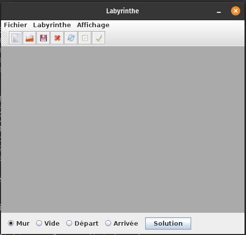
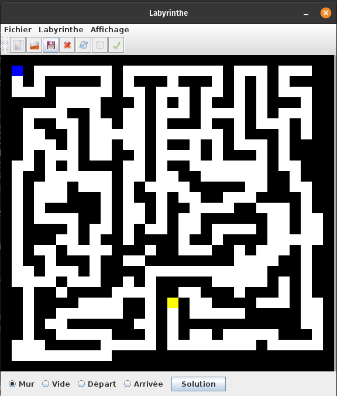
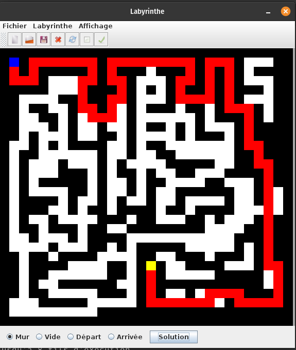

# Installation

```
git clone git@gitlab.enst.fr:2021INF103/groupe2/masschelier-paul-marie.git
cd masschelier-paul-marie
```
Pour lancer le programme
```
make run
```
Pour créer la documentation (entrée : doc/index.html) :
```
make doc
```

# Fonctionnalités

Interface de l'application au lancement :



On peut ensuite soit dessiner un labyrinthe en séléctionnant la case à dessiner à chaque fois avec les boutons radio situés en bas de la fenêtre.
Ou bien on charge un labyrinthe sur le disque à l'aide du menu Fichier > Ouvrir



On peut résoudre le labyrinthe en cliquant sur le bouton "Solution"



## Autre fonctionnalités :
- Enregistrer un labyrinthe sur le disque
- Fermer ou effacer un labyrinther
- Créer un nouveau labyrinthe vide ou avec un contenu aléatoire
- Choisir le thème de la fenêtre

J'ai fait le choix d'implémenter l'algorithme de Dijkstra avec un tas afin d'avoir une complexité moindre que celle de l'implémentation proposée par le sujet.
